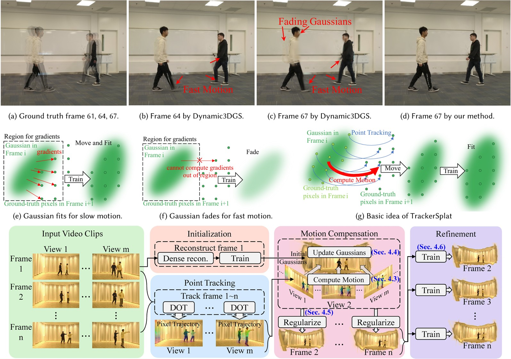

# (SIGGRAPH Asia 2025) [TrackerSplat: Exploiting Point Tracking for Fast and Robust Dynamic 3D Gaussians Reconstruction](http://profile.yindaheng98.top/TrackerSplat2025SIGGRAPHAsia.pdf)



## Prerequisites

* [Pytorch](https://pytorch.org/) (v2.4 or higher recommended)
* [CUDA Toolkit](https://developer.nvidia.com/cuda-12-4-0-download-archive) (12.4 recommended, should match with PyTorch version)

Install [`gaussian-splatting`](https://github.com/yindaheng98/gaussian-splatting), [`InstantSplat`](https://github.com/yindaheng98/InstantSplat), [`reduced-3dgs`](https://github.com/yindaheng98/reduced-3dgs) and download related models:

```sh
pip install wheel setuptools
pip install --upgrade git+https://github.com/yindaheng98/gaussian-splatting.git@master --no-build-isolation
pip install --upgrade git+https://github.com/yindaheng98/InstantSplat.git@main --no-build-isolation
pip install --upgrade git+https://github.com/yindaheng98/reduced-3dgs.git@main --no-build-isolation
pip install --upgrade git+https://github.com/yindaheng98/ExtrinsicInterpolator.git@master --no-build-isolation
pip install -U xformers==0.0.12 --no-deps
conda install conda-forge::colmap
```

Install dependencies:

```sh
pip install --upgrade git+https://github.com/facebookresearch/co-tracker.git@main
pip install -U taichi einshape timm triton jaxtyping
pip install -U numpy==1.26.4
pip install -U imageio==2.37.0 imageio-ffmpeg==0.4.7
```

## PyPI Install

```shell
pip install wheel setuptools
pip install --upgrade git+https://github.com/yindaheng98/TrackerSplat.git@main
```

### Development Install

```shell
git clone --recursive https://github.com/yindaheng98/TrackerSplat
cd TrackerSplat
pip install --target . --upgrade --no-deps .
```

(Optional) If you prefer not to install our custom packages in your environment, you can install it in your development directory:

```shell
git clone --recursive https://github.com/yindaheng98/TrackerSplat
cd TrackerSplat
pip install --target . --upgrade --no-deps .
pip install --target . --no-deps --upgrade git+https://github.com/yindaheng98/gaussian-splatting.git@master
pip install --target . --no-deps --upgrade git+https://github.com/yindaheng98/InstantSplat.git@main
pip install --target . --no-deps --upgrade git+https://github.com/yindaheng98/reduced-3dgs.git@main
pip install --target . --upgrade --no-deps git+https://github.com/yindaheng98/ExtrinsicInterpolator.git@master
```

## Download pth

For `InstantSplat`:
```sh
wget -P checkpoints/ https://download.europe.naverlabs.com/ComputerVision/DUSt3R/DUSt3R_ViTLarge_BaseDecoder_224_linear.pth
wget -P checkpoints/ https://download.europe.naverlabs.com/ComputerVision/DUSt3R/DUSt3R_ViTLarge_BaseDecoder_512_linear.pth
wget -P checkpoints/ https://download.europe.naverlabs.com/ComputerVision/DUSt3R/DUSt3R_ViTLarge_BaseDecoder_512_dpt.pth
wget -P checkpoints/ https://download.europe.naverlabs.com/ComputerVision/MASt3R/MASt3R_ViTLarge_BaseDecoder_512_catmlpdpt_metric.pth
wget -P checkpoints/ https://huggingface.co/depth-anything/Depth-Anything-V2-Small/resolve/main/depth_anything_v2_vits.pth
wget -P checkpoints/ https://huggingface.co/depth-anything/Depth-Anything-V2-Base/resolve/main/depth_anything_v2_vitb.pth
wget -P checkpoints/ https://huggingface.co/depth-anything/Depth-Anything-V2-Large/resolve/main/depth_anything_v2_vitl.pth
```

dot
```shell
wget -P checkpoints https://huggingface.co/16lemoing/dot/resolve/main/cvo_raft_patch_8.pth
wget -P checkpoints https://huggingface.co/16lemoing/dot/resolve/main/movi_f_raft_patch_4_alpha.pth
wget -P checkpoints https://huggingface.co/16lemoing/dot/resolve/main/movi_f_cotracker_patch_4_wind_8.pth
wget -P checkpoints https://huggingface.co/16lemoing/dot/resolve/main/movi_f_cotracker2_patch_4_wind_8.pth
wget -P checkpoints https://huggingface.co/16lemoing/dot/resolve/main/panning_movi_e_tapir.pth
wget -P checkpoints https://huggingface.co/16lemoing/dot/resolve/main/panning_movi_e_plus_bootstapir.pth
```

cotracker
```shell
wget -P checkpoints https://huggingface.co/facebook/cotracker3/resolve/main/scaled_offline.pth
```

## Quick Start

### Prepare Datasets

Download datasets and extract them into `./data`:

* [Neural 3D Video dataset](https://github.com/facebookresearch/Neural_3D_Video/releases/tag/v1.0)
* [st-nerf dataset](https://hkustconnect-my.sharepoint.com/:f:/g/personal/xliufe_connect_ust_hk/EjqArjZxmmtDplj_IrwlUq0BMUyG69zr5YqXFBxgku4rRQ?e=n2fSBs)
* [Meet Room dataset](https://drive.google.com/drive/folders/1lNmQ6_ykyKjT6UKy-SnqWoSlI5yjh3l_)
* [Dynamic 3D Gaussians dataset](https://omnomnom.vision.rwth-aachen.de/data/Dynamic3DGaussians/data.zip)

For Neural 3D Video dataset:
```
data
|-coffee_martini.zip
|-cook_spinach.zip
|-cut_roasted_beef.zip
|-flame_salmon_1_split.z01
|-flame_salmon_1_split.z02
|-flame_salmon_1_split.z03
|-flame_salmon_1_split.zip
|-flame_steak.zip
|-sear_steak.zip
```

For st-nerf dataset:
```
data
|-boxing.zip
|-taekwondo.zip
|-walking.zip
```

For Meet Room dataset:
```
data
|-discussion.zip
|-stepin.zip
|-trimming.zip
|-vrheadset.zip
```

For Dynamic 3D Gaussians dataset:
```
data
|-data.zip
```

Run scripts to extract these datasets to proper format:
```sh
./tools/extract_dataset.sh
```

Run scripts to convert and initialize camera poses for all datasets:
```sh
./tools/init_dataset.sh
./tools/init_dataset_dense.sh
```

### Run the experiment

Experiment on all our methods and baselines
```sh
./tools/motionestimation_long.sh
```

Then you can see the quality (PANR, SSIM, LIPIPS) of each training step in output folder: `output/<name of dataset>/<name of method>/frame2/log/iteration_1000/log.csv`

### Long video experiment

TBD